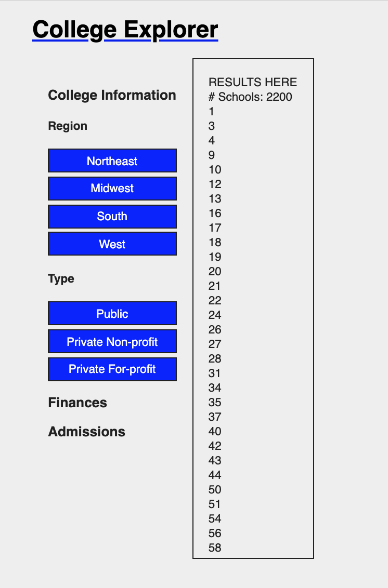
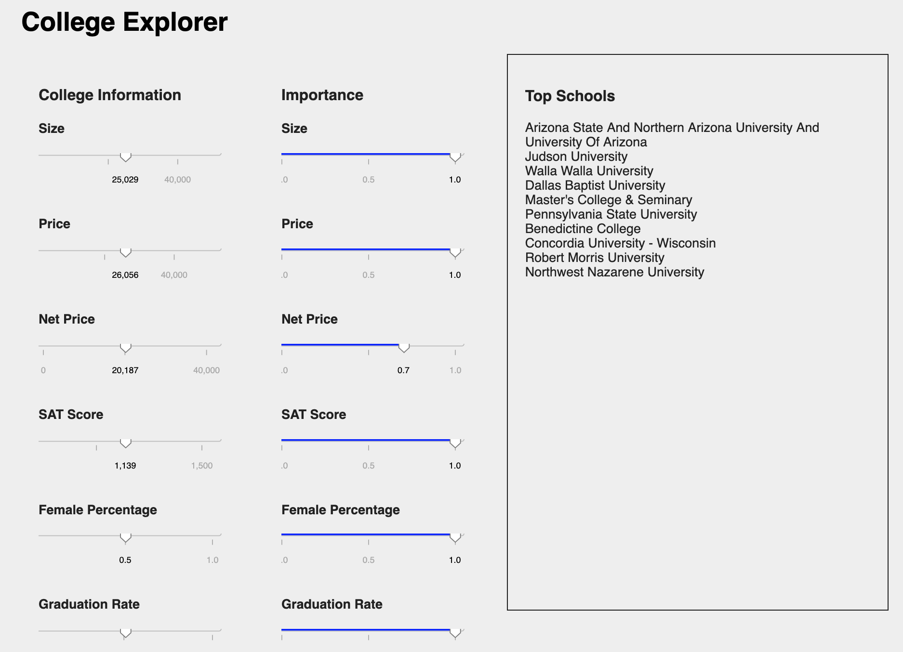
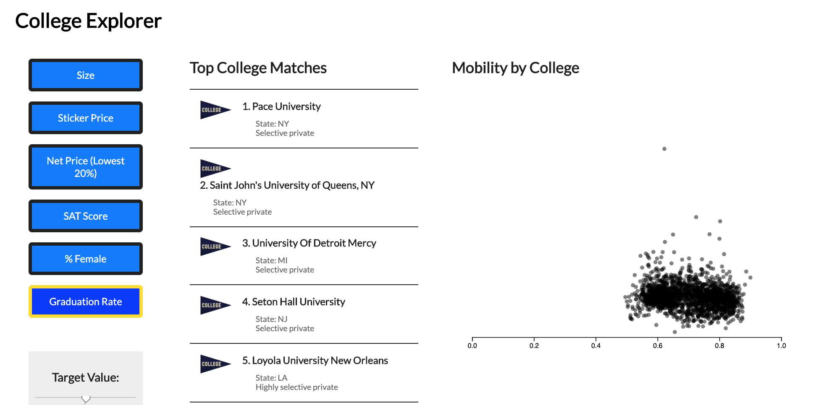
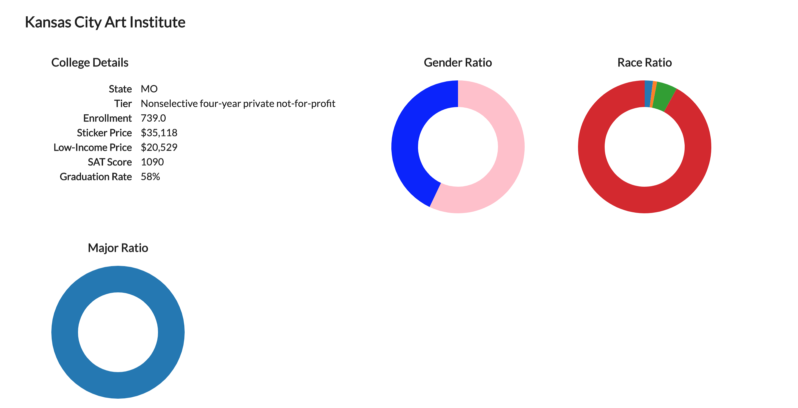
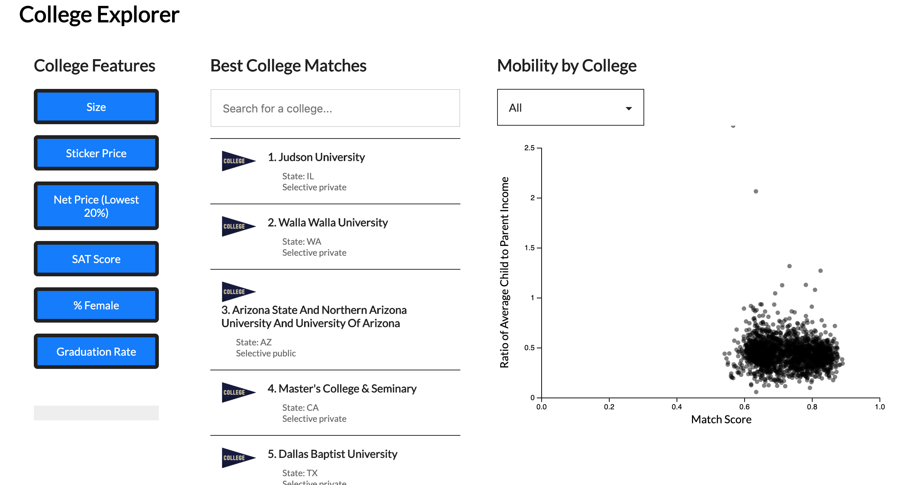
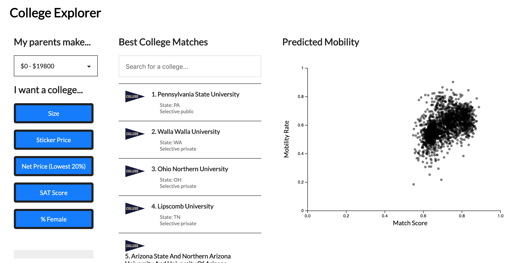
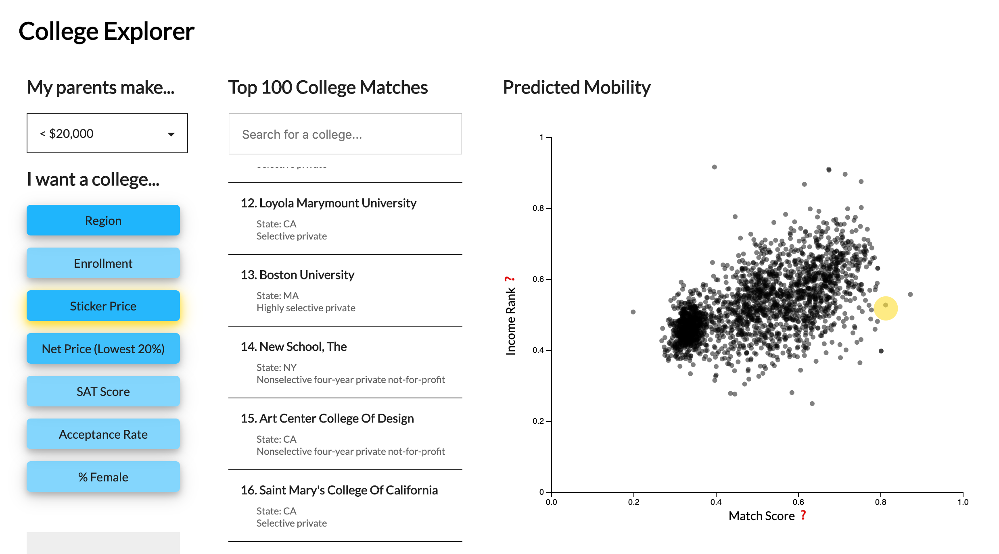
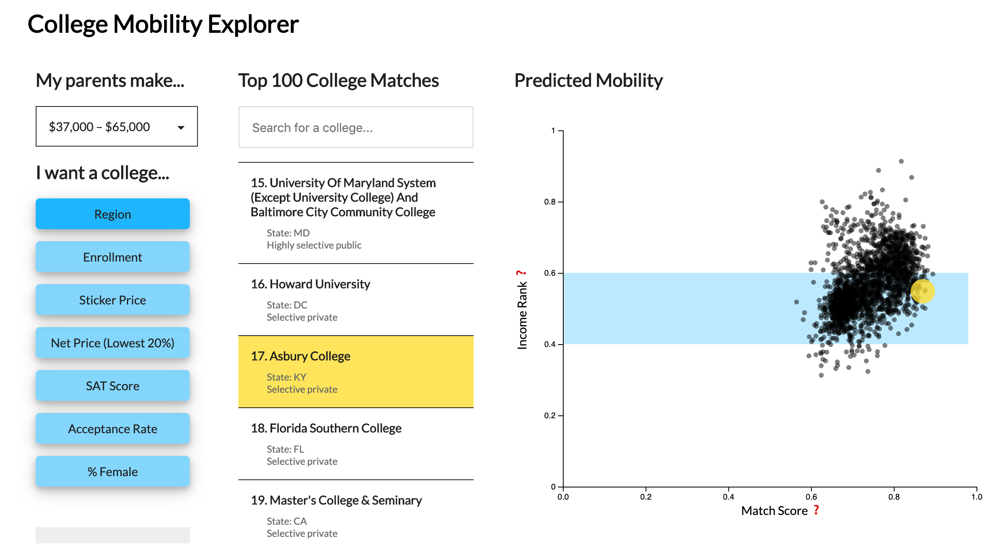

# College Mobility Explorer

## Development Process  
The project was developed iteratively over about 6 weeks with feedback from various sources (classmates & subject matter experts).

For the initial design, we knew we wanted to create a tool that was actually useful for high school students to explore their college options. On this front, we wanted a level of interaction in selecting important features of a college, but we also wanted some way to depict long-term income mobility for each college. With some inspiration from the existing Opportunity Insights research as well as the New York Times, we came up with the idea of a scatterplot with the axes depicting the two quantitative variables of mobility (approximated as income) and feature match. Additionally, to keep this tool a useful tool for selecting colleges for individual students, we included a list of best college matches (based solely on desired features) and detailed information about each of these colleges. With this design, students can visually see that the highest mobility school is not necessarily the "best" school for them. On the contrary, the "best" school for each student is trade-off between their "match" to the school based on desirable features and the potential that they may have after attending these colleges.

With our initial design, one of our biggest challenges was depicting a measure of "mobility" for each college. We began by using a ratio of child to parent income as an approximation of the change in economic class. However, we found that this wasn't very fine-grained with regards to considering different parental incomes, and it also overly negatively weighted schools where students began richer on average. We also struggled with differentiating objective income from an actual change in mobility, where the latter was the overall goal but the former was also relevant and important. Additionally, we wanted to account for the difference in starting economic class, which was one of the big issues in our first design.

Upon consultation from a researcher from this domain, we finally decided upon depicting income rank as our final measure of mobility, the y-axis of the mobility scatterplot. This income was split into subgroups by parental income to give a more detailed and realistic view for students based on their starting income class, and it also fixes the issue of schools with more richer students being weighted unfairly. The trade-off here, though, is that the mobility is somewhat indirectly displayed using the segmentation of starting income class. Income rank on its own does not actually depict "mobility" as opposed to an objective measure of wealth. The "mobility" offered for each school is actually represented by the distance between the point representing that school on the scatterplot and the blue band representing the parental starting income. We chose this measure because it does maintain the idea of mobility, especially with the blue band representing a start value, while also offering a level of objectivity by showing a set value for income. In this case, for example, it is possible to see that students who start richer on average end up richer. However, this design does maintain the possibility of comparing mobility opportunity from different colleges.

### Development Time Lapse

Initial design of top colleges, filters to select desired categorical features  
  

Initial design for quantitative features and importances  
  

UI redesign, packing of quantitative features to be more space-efficient, as well as initial design for mobility scatterplot and school
drill-down  

  

Addition of school search bar and ability to select for starting parental income quintile  
  

Change of mobility metric to depict the mean income from each college (note increased spread of points)  
  

UI redesign, addition of tooltips giving more information about the calculated scores  
  

Addition of blue bar depicting starting parental income  

## Work Split
Erica worked mainly on the data wrangling and mathematical transformations, as well as generating the mobility scatterplot. On this front, the major tasks were joining different datasets to get the necessary data for the visualization and putting them in a useful format for creating the normalized "match score." Additionally, she developed the algorithm for actually creating the weighted match score as a metric to approximate how well colleges correlate to an individual's desires. Finally, on the front end side, she designed the scatterplot and sliders for the quantitative features.

Ariel worked more on the front-end side developing the overall website design and layout. In terms of specific features, she built the top 100 matches, the selector for categorical features, the search bar for individual colleges, the dropdown for income quintile selection, as well as the drill-down with more specific information (both in written form and graphically) about individual colleges. She also designed the tooltips for learning more about what each axis of the scatterplot represents.

Both team members collaborated to come up with the initial design of the mobility/match score scatterplot, as well as creating on the video and writing the paper.

## Data Sources
[Opportunity Insights](https://opportunityinsights.org/data/)  
[IPEDS](https://nces.ed.gov/ipeds/use-the-data)  
[College Websites](https://data.mhec.state.md.us/MAC2Pilot/OPEID.xls)
